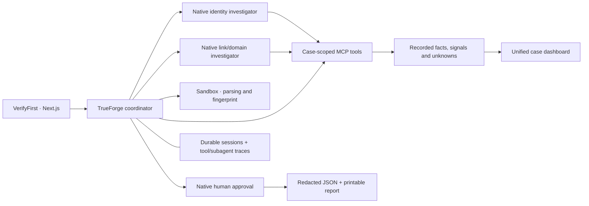
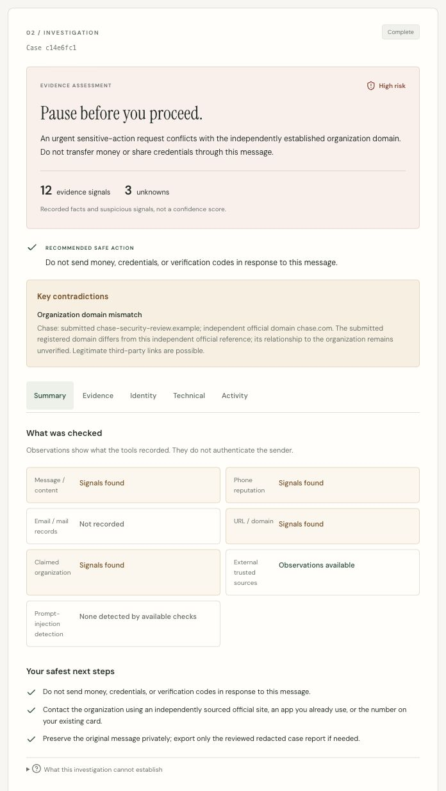
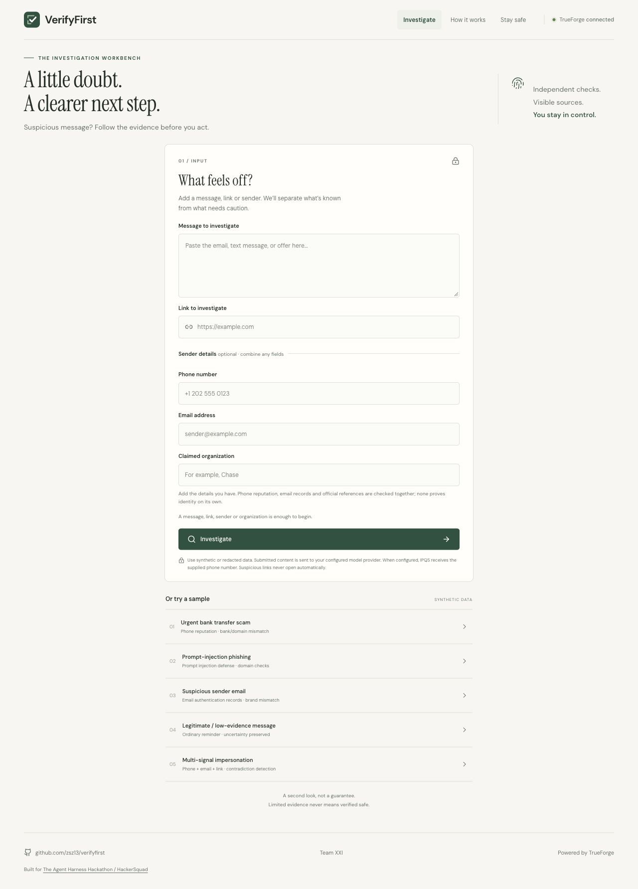
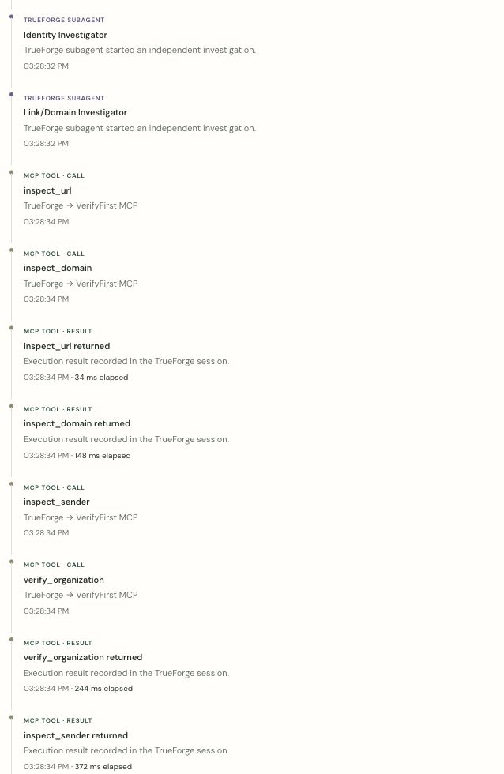
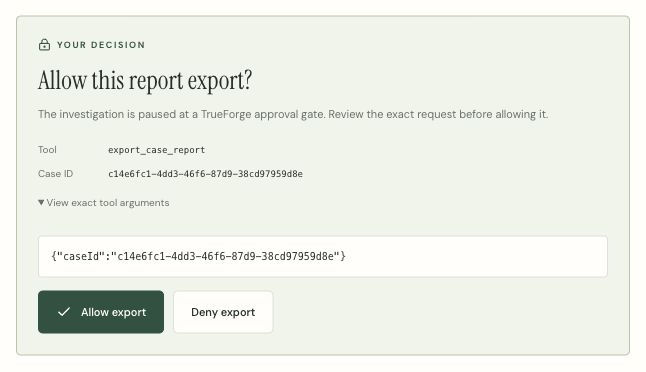

# VerifyFirst

**Evidence before action.** VerifyFirst investigates suspicious messages, links, phone numbers, email senders and claimed organizations together, then finishes an evidence-backed case report with safe next steps.

A chatbot can comment on wording. VerifyFirst **does the investigation**: calls external tools, compares claimed identities with independent organization references, exposes contradictions and missing evidence, and pauses for human approval before exporting. It never treats a suspicious message as instructions or calls a message-provided contact to establish trust.

**TrueForge is the execution harness, not a chat wrapper.** The official SDK runs a coordinator agent, two native scoped subagents for combined identity/link cases, eight MCP tools, sandbox code execution when available, a native human-approval pause, durable sessions and inspectable traces. There is no parallel agent loop or direct model-provider call in VerifyFirst. The integration is pinned to **TrueForge 0.2.0**.



**Verification signals:** optional IPQS phone reputation; email DNS/MX/SPF/DMARC records; URL redirects and public-network safety; domain DNS/RDAP and lookalike indicators; independent organization references; trusted anti-scam sources; prompt-injection signals. These are evidence, not proof of sender identity. No SAFE verdict or invented confidence score is produced.

## The 3-minute demo

With the services running and a model configured:

1. **0:00–0:30 — Investigate:** open `/`, select **Urgent bank transfer scam**, and click **Investigate**. The message, fake phone, reserved URL and claimed bank fill together.
2. **0:30–1:30 — Watch real work:** open **Activity** as results arrive. Show the coordinator, Identity and Link/Domain investigators, MCP results and actual sandbox execution. In TrueForge on port 8790, open the matching session to inspect the native trace.
3. **1:30–2:20 — Explain the result:** show **Summary** and **Identity**. The urgent transfer request conflicts with the independently sourced bank domain. IPQS is explicitly third-party evidence; a fictional number may have little usable reputation. Missing data remains unknown.
4. **2:20–3:00 — Finish the job:** show the native approval card, click **Allow export**, and watch JSON download automatically after completion. Open **Print / save PDF** for the human-readable evidence report. Click the logo to return to a clean new investigation.

Timings are a presentation target, not a latency guarantee. All five samples are synthetic; `.example` domains intentionally do not resolve. A lookup failure alone never establishes fraud. Try **Prompt-injection phishing**, **Suspicious sender email**, **Legitimate / low-evidence message**, and **Multi-signal impersonation** to inspect the other boundaries. Each button replaces all relevant input fields; switching to the ordinary reminder clears old identity fields.



<details>
<summary>See the input, native execution activity and approval pause</summary>







</details>

## Fastest local setup

Requires **Node.js 22.14+**, npm, internet access and a model-provider key with available credit. Keep this single-user application on localhost.

```bash
git clone https://github.com/zsz13/verifyfirst.git
cd verifyfirst
npm ci
cp .env.example .env
npm run dev
```

Open **http://127.0.0.1:8790 → Settings → Models**, configure a provider, then open **http://127.0.0.1:3000** and click **Reconnect**. Choose **Urgent bank transfer scam**, then investigate. The first configured model is selected unless `TRUEFORGE_MODEL` names another configured model.

`npm run dev` starts TrueForge on 8790, registers the private MCP connector, starts tools on 8791 and the frontend on 3000. Setup generates the MCP token. Provider settings and sessions live outside the checkout in `~/.local/share/verifyfirst/trueforge.sqlite`; case evidence lives in ignored `.data/`.

### Provider and optional environment configuration

No API key is needed to build, test or run offline evaluations. A model provider is required for live investigations. Configure it through TrueForge Settings or set `MODEL_PROVIDER` and `MODEL_API_KEY`, then run `npm run setup` while TrueForge is running. `OPENAI_API_KEY` is also recognized.

To keep provider credentials outside the repository:

```bash
VERIFYFIRST_ENV_FILE=/absolute/path/to/private-provider.env npm run setup
```

The external env file is read at runtime; its contents are not copied into the checkout. TrueForge persists its own private credential record. Never put secrets in source, committed files, reports or build arguments.

Useful settings in [.env.example](.env.example):

- `TRUEFORGE_BASE_URL`: harness API, default `http://127.0.0.1:8790`.
- `TRUEFORGE_MODEL`: exact configured model name; blank selects the first available model.
- `MODEL_PROVIDER` / `MODEL_API_KEY`, or `OPENAI_API_KEY`: optional automated provider setup.
- `VERIFYFIRST_ENV_FILE`: external provider env file, supplied through your shell.
- `VERIFYFIRST_MCP_TOKEN`: generated automatically; authenticates the case-scoped connector.
- `MCP_HOST`, `MCP_PORT`, `VERIFYFIRST_MCP_URL`: localhost defaults; Compose sets its internal service addresses.
- `TRUEFORGE_SANDBOX=auto`: use an available supported sandbox; `false` disables it.
- `DAYTONA_API_KEY`: optional sandbox provider configuration through setup.
- `TRUEFORGE_SUBAGENTS=true`: enable native scoped investigators; `false` uses the coordinator alone.
- `IPQS_API_KEY` or `IPQS_API_KEY_FILE`: optional phone reputation; see below.
- Any credential above may instead be a file in `secrets/` named after the variable,
  lowercased (`secrets/ipqs_api_key`). A file wins over the environment variable.
- `VERIFYFIRST_DATA_DIR`: optional private case-storage location; defaults to `.data/`.
- `TRUEFORGE_TOKEN`: optional authenticated hosted TrueForge token.

Restart affected services after changing environment configuration.

### Optional IPQualityScore phone reputation

Core investigations work without IPQS. To enrich phone evidence, set `IPQS_API_KEY` in your runtime environment or set `IPQS_API_KEY_FILE` to an external text file containing only the authorized key. Keep that file outside the repository and readable only by the runtime user. The MCP service sends the key in the documented **`IPQS-KEY` header**, never the request URL.

IPQS observations include available validity/activity, fraud score, risky/recent-abuse/spammer flags, VOIP/prepaid status, carrier, line type and country/region. These are attributed third-party signals. Neither one score nor a valid number authenticates a caller or proves fraud. Missing keys, rate limits, invalid responses and service outages preserve local normalization and explicit uncertainty.

See the [official Phone Number Validation API documentation](https://www.ipqualityscore.com/documentation/phone-number-validation-api/overview).

### Sandbox

On supported macOS/Linux hosts, pinned TrueForge 0.2.0 includes a native local sandbox fallback. Availability is probed by TrueForge. Nested OS sandboxes or missing system utilities can prevent it; use a normal terminal or configure **Settings → Sandbox providers → Daytona**. Daytona needs sandbox access and snapshot-creation permission.

The sandbox performs standard-library parsing, hostname inspection and fingerprinting. If unavailable, MCP investigation continues and the UI reports the limitation. No ordinary host execution substitutes for an isolated sandbox, and no OS security control is disabled.

## Docker / Compose

Requires a running Docker engine and **Docker Compose v2+**. One pinned Dockerfile and build context produce the image behind the production frontend, MCP server, setup and TrueForge, so the layers are built once and shared. Ports are published only on localhost; the MCP service stays on the private Compose network.

### Quick start

```bash
git clone https://github.com/zsz13/verifyfirst.git
cd verifyfirst
cp .env.example .env          # optional: edit it to add a model key
docker compose up --build
```

| Service     | URL                       |
| ----------- | ------------------------- |
| VerifyFirst | **http://127.0.0.1:3000** |
| TrueForge   | **http://127.0.0.1:8790** |

Nothing in `.env` is required to start. With no `.env` at all the stack still
builds, every service becomes healthy and the UI loads; it reports
`Awaiting model` until you configure one. Stop any local process already holding
port 3000 or 8790 first.

**Credentials, and when each one matters**

| Credential                         | Needed for                       | Without it                                                |
| ---------------------------------- | -------------------------------- | --------------------------------------------------------- |
| `MODEL_PROVIDER` + `MODEL_API_KEY` | running an investigation         | Everything starts; the UI says a model must be configured |
| `OPENAI_API_KEY`                   | shortcut for the OpenAI provider | As above                                                  |
| `IPQS_API_KEY`                     | third-party phone reputation     | Phone checks use local numbering-plan analysis only       |
| `DAYTONA_API_KEY`                  | isolated sandbox execution       | The agent runs without a sandbox; the UI reflects that    |
| `TRUEFORGE_TOKEN`                  | a hosted TrueForge               | Unused by this local topology                             |

No credential is required for startup, so an absent optional key is never a
startup failure. A model is the only one an investigation cannot run without,
and you can supply it either in `.env` or in the TrueForge UI under
**Settings → Models** — both routes are equivalent.

**Advanced: file-based secrets instead of `.env`**

Put the value in a file under `secrets/` named after the variable, lowercased.
The directory is mounted read-only into the containers that need it and is
git-ignored:

```bash
printf '%s' 'your-key-here' > secrets/ipqs_api_key
chmod 600 secrets/ipqs_api_key
docker compose up --build
```

Resolution order for every credential is the same and is applied at the point
the feature is used:

1. `<NAME>_FILE`, if set — an explicit path that cannot be read is reported as an error, never silently ignored.
2. `secrets/<name>` — used when that file exists; absent is normal.
3. `<NAME>` environment variable, from `.env` or your shell.
4. Otherwise the integration reports itself as not configured.

Use `<NAME>_FILE` only to point at a mount your orchestrator provides; the
`secrets/` directory needs no absolute paths and works the same on every machine.
See `secrets/README.md`. Secrets are excluded from the Docker build context and
never enter an image layer or a build argument.

You can also keep credentials entirely outside the repository with an external
Compose env file:

```bash
docker compose --env-file /path/to/private-runtime.env up --build -d
```

Compose takes its project namespace from the checkout directory, so `~/verifyfirst` and `~/verifyfirst-test` get separate containers, networks, volumes and built images and never share state. Pass `-p` for an explicit name:

```bash
docker compose -p my-name up --build
```

Compose creates a private MCP token automatically. Named volumes preserve cases, approvals, sessions and provider settings across restart. They are scoped to the project, so `docker compose down -v` only ever removes the current checkout's data. The containers run as a non-root user, drop capabilities and have no Docker socket, privileged mode or source mount. A secret file must be readable by container UID 1000; if it is not, VerifyFirst says so explicitly rather than failing silently. Never broaden access to a private key just to satisfy container permissions.

**Sandbox execution inside Docker requires an available TrueForge sandbox provider.** Configure Daytona in Settings for reliable isolated execution. The restrictive container intentionally does not grant privileges to force the host-local sandbox to work. Availability and actual execution remain visible; Docker itself is not claimed as the agent sandbox.

```bash
docker compose logs --tail=80 web mcp setup
docker compose restart web mcp
# Reapply changed model/sandbox environment settings:
docker compose run --rm setup
# Stop services while keeping data:
docker compose down
```

`trueforge`, `mcp` and `web` restart on failure, so a service that keeps failing shows as `Restarting` in `docker compose ps` rather than sitting at an exit code; read its logs. `init` and `setup` are one-shot and exit 0 when they succeed — a failed `setup` stops `up` with `service "setup" didn't complete successfully`. Ctrl+C stops the long-running services with exit 0; interrupting `up` while `setup` is still waiting on its dependencies leaves that one-shot at exit 143, which is the interrupt rather than a fault.

Do not use `down --volumes` unless you intend to delete saved cases and harness credentials. Do not print expanded Compose configuration when a real env file is active: interpolation can contain secrets.

This is a localhost demo topology. For a shared harness, use TrueForge's [official hosted setup](https://trueforge.dev/quickstart) and authentication guidance; this frontend has no multi-user authorization and must not be exposed publicly. The official hosted topology uses Postgres and Redis. This Compose setup retains the project's single-process SQLite integration rather than introducing new infrastructure.

## Investigation and demo flow

1. Choose **Urgent bank transfer scam**, or paste a message. A single detected link fills the editable link field; multiple links appear separately and all are investigated. Up to five distinct links are accepted. Links never open automatically.
2. Add phone, email and a claimed organization together when available. These fields are untrusted claims; supplied contact details never become verified contacts. Use an explicit `+country code` for phone normalization.
3. Investigate. Inspect the risk summary, meaningful signals, contradictions and recommended safe action. Deeper evidence, identity, technical checks and activity remain available without overwhelming the summary.
4. At the native approval pause, refresh to confirm durable recovery. **Allow export** resumes TrueForge and automatically downloads the redacted JSON after completion. **Download again** is the fallback. Open the approved human report and use browser **Print / Save as PDF**.
5. Try the injection, sender-email, ordinary-reminder and multi-signal samples. Embedded instructions must be ignored, while insufficient evidence must remain UNKNOWN/LOW EVIDENCE rather than automatic HIGH RISK.

Export creates a local report; it does not contact a bank, regulator or other third party. Both JSON and printable HTML remain unavailable until approval. Activity shows real timestamps with seconds and measured call-to-result elapsed time, including scheduling and approval waits.

See [demo scenarios](docs/DEMO.md) and [verification procedure](docs/VERIFICATION.md).

## Architecture and capabilities

```text
apps/web/   Next.js + TypeScript investigation UI and local API
apps/mcp/   Eight case-scoped investigation and report tools
agent/      TrueForge SDK integration, policy, reports and session mapping
fixtures/   Five synthetic multi-signal demo samples
evals/      Offline cases and live TrueForge scenarios
tests/      Tool, evidence, approval, recovery and API tests
scripts/    Local startup, container entrypoints and setup
docs/       Architecture, demo and verification guidance
```

The main TrueForge agent coordinates content analysis, independent sources, sandbox work and report/export. Native identity and link/domain investigators can perform scoped independent checks for multi-signal cases; their activity remains in the TrueForge session trace. They cannot authorize export. The coordinator merges tool-owned observations into one case.

MCP tools:

- `analyze_submission`: extract supplied URLs, organizations, contacts, actions, urgency and known injection patterns.
- `inspect_sender`: investigate original phone/email identities, optional IPQS reputation, email DNS/MX/SPF/DMARC, domain registration and organization mismatch.
- `inspect_domain`: normalize hostnames and inspect punycode/lookalike patterns, DNS and RDAP where available.
- `inspect_url`: inspect bounded public HTTP(S) responses and redirects without JavaScript or cookies.
- `search_trusted_sources`: retrieve matching official pages from a bounded FTC, CFPB and Postal Inspection Service catalog; not unrestricted web search.
- `verify_organization`: independently maintained Chase, Bank of America, Wells Fargo, PayPal and USPS references plus live official contact/security pages.
- `create_case_report`: deterministic risk, comparisons, limitations and recommended actions from recorded evidence.
- `export_case_report`: native approval plus a one-use case/report-bound grant; redacted JSON and a printable HTML representation of the same artifact.

See [architecture and safety decisions](docs/ARCHITECTURE.md). Opening `/` or clicking the logo/Investigate navigation starts a clean investigation. Bookmark the `/?case=<id>` link to reopen a case; refreshing or reconnecting on that link recovers its persisted harness session. Returning home does not cancel or delete the investigation.

## Test and evaluate

```bash
npm ci
npm run check        # lint, typecheck, tests, offline evals, production build
npm run format:check

# Browser navigation regressions; production build from check must exist:
npx playwright install chromium
npm run test:browser

# Services running; network required, no model required:
node --import tsx --env-file=.env scripts/smoke-tools.ts

# Configured model required; consumes provider credit:
npm run eval:live
# Combined message/URLs/phone/email + native subagent acceptance:
npm run eval:signals
```

Offline evaluations exercise real parsing/report/export boundaries without pretending to prove model execution. Live evaluations check actual MCP use, sourced evidence, native approval/denial, injection handling, uncertainty and sandbox execution when available. They deny export automatically; successful approval is exercised through the frontend. Generated case/session data remains ignored.

For a production frontend with local services:

```bash
# Terminal 1
npm run dev:harness
# Terminal 2, after TrueForge starts
npm run setup
npm run dev:mcp
# Terminal 3
npm run build
npm start
```

## Safety and limitations

- All submitted and retrieved content is untrusted data. Injection pattern detection is not exhaustive; case binding, authoritative originals, fixed tool capabilities and approval grants enforce separate boundaries.
- Only public HTTP(S), standard ports and revalidated redirects are inspected. DNS pinning, address filtering, deadlines and byte limits restrict SSRF and resource abuse.
- Facts, suspicious signals and unknowns are labeled separately from conclusions. No SAFE verdict or invented numeric confidence is produced.
- Official domains, HTTPS, domain age, IPQS scores and email DNS records never authenticate a sender. Email-header SPF/DKIM validation and mailbox ownership checks are not performed. Caller ID can be spoofed.
- Unsupported organizations and unavailable sources remain unknown. The organization catalog and reference search are deliberately bounded. IPQS and other external services can be incomplete or wrong.
- Model execution can stop early and sandbox steps can fail. Live evaluations check the approval pause and actual execution; no export is allowed without approval even when an investigation is incomplete.
- Case/session data may contain sensitive input. Use synthetic or redacted data. Export strips common contact patterns and URL queries but is not comprehensive anonymization.
- No accounts or tenant isolation are provided. Keep services on localhost and do not expose them through public tunnels.

Built for [The Agent Harness Hackathon / HackerSquad](https://hackersquad.io/events/truefoundry-agent-harness-hackathon). Official TrueForge references: [quickstart](https://trueforge.dev/quickstart), [SDK](https://trueforge.dev/api/quickstart), [approvals](https://trueforge.dev/api/use-agent), [subagents](https://trueforge.dev/key-features/subagents), [sandbox](https://trueforge.dev/sandbox), [source](https://github.com/truefoundry/trueforge). Installed 0.2.0 types/runtime remain the compatibility reference where documentation differs.
